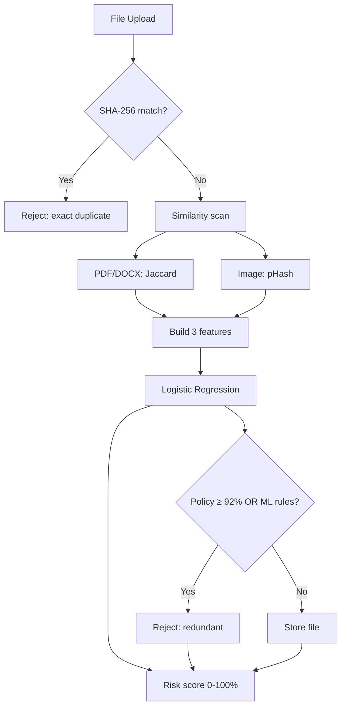

# AI-Based Redundancy Prediction and Optimization (Cloud Storage Demo)

Full-stack demo: **FastAPI** backend (SHA-256 dedup, PDF + **Word (.docx)** text, image pHash similarity, configurable **policy threshold** %, scikit-learn classifier, risk score, unified-diff **guidance**) and **React + Vite** dashboard.

## Quick start (team setup)

**New team members:** follow **[SETUP_GUIDE.md](SETUP_GUIDE.md)** (step-by-step) or open **[docs/SETUP_GUIDE.html](docs/SETUP_GUIDE.html)** and print to PDF.

| Step | Windows | macOS / Linux |
|------|---------|---------------|
| **1. One-time setup** | `.\scripts\setup.ps1` | `chmod +x scripts/*.sh && ./scripts/setup.sh` |
| **2. Start servers** | `.\scripts\start-all.ps1` | `./scripts/start-backend.sh` + `./scripts/start-frontend.sh` |
| **3. Open app** | http://localhost:5173 | same |
| **4. Login** | Admin: `admin` / `ADMIN123` · User: `user` / `USER123` | same |

Double-click on Windows: `scripts\setup.bat` (install) or `scripts\start-all.bat` (install + run).

> **Both** backend (port 8000) and frontend must be running. If the backend is down, uploads fail with a 500 error.

## Prerequisites

- Python 3.10+
- Node.js 18+

## Backend (manual)

Use the **same Python** you used for `pip` (on Windows, `where python` may point to a stub; if imports fail, run with `py -3.14` or your venv’s `python.exe`).

```powershell
cd backend
python -m venv .venv
.\.venv\Scripts\Activate.ps1
pip install -r ..\requirements.txt
python -m uvicorn app.main:app --reload --host 127.0.0.1 --port 8000
```

API: `http://127.0.0.1:8000` — OpenAPI docs: `/docs`

## Frontend (manual)

```powershell
cd frontend
npm install
npm run dev
```

Open `http://127.0.0.1:5173` (Vite proxies `/api` to the backend).

---

## How AI Works

This section explains the full intelligence pipeline — what is machine learning, what is rule-based, and how a file upload becomes a **stored / rejected** decision with a **risk score**.

### Pipeline overview


When you upload a file, the backend runs these stages in order:

| Step | What happens | Technique |
|------|----------------|-----------|
| 1 | File received | FastAPI upload endpoint |
| 2 | Exact duplicate check | SHA-256 hash comparison |
| 3 | Content similarity scan | Jaccard (docs) or pHash (images) |
| 4 | Feature extraction | 3 numeric values for ML |
| 5 | ML prediction | Logistic Regression → redundancy probability |
| 6 | Final decision | Policy rules + ML rules |
| 7 | Dashboard output | Risk score, guidance, logs |

### Step 1 — Exact duplicate (not ML)

Every file is hashed with **SHA-256**. If the hash already exists in the database, the file is rejected immediately as a **byte-identical duplicate**. No AI is involved here — this is deterministic hashing.

**Code:** `backend/app/services/hasher.py`, `backend/app/services/process_upload.py`

### Step 2 — Similarity analysis (classical algorithms, not neural nets)

If the file is not an exact duplicate, it is compared against all previously **stored** files.

#### Documents (PDF, DOCX)

1. Text is extracted from the upload (`pypdf` for PDF, `python-docx` for Word).
2. Each stored document’s text excerpt is compared using **Jaccard word similarity**:

   ```
   similarity = |words in both| / |words in either|
   ```

   Example: if two reports share 85% of their unique words, `max_similarity = 0.85`.

**Code:** `backend/app/services/pdf_text.py`, `backend/app/services/docx_text.py`

#### Images (JPEG, PNG, WebP, GIF)

1. A **perceptual hash (pHash)** is computed for the image.
2. Stored image hashes are compared via Hamming distance.
3. Distance is converted to a similarity score (0–1).

Visually similar images get similar hashes even when pixels differ slightly (resize, compression, minor edits).

**Code:** `backend/app/services/image_sim.py`

The scan also counts **neighbor files** — how many stored files have similarity ≥ 55%. This feeds into the ML model.

### Step 3 — Feature engineering (input to ML)

Three features are built from the similarity scan:

| Feature | Description | Range |
|---------|-------------|-------|
| `max_similarity` | Best match score against any stored file | 0.0 – 1.0 |
| `size_ratio` | Size of smaller file ÷ size of larger file (vs best match) | 0.0 – 1.0 |
| `neighbor_frequency` | Number of similar files (≥55%), capped at 5, divided by 5 | 0.0 – 1.0 |

**Code:** `backend/app/services/features.py`

### Step 4 — Machine learning model (the AI core)

This is where **machine learning** is used.

#### Model type

- **Algorithm:** Logistic Regression (scikit-learn)
- **Pipeline:** `StandardScaler` → `LogisticRegression`
- **Output:** Probability that the file is **redundant** (class 1), between 0 and 1

#### Training

On first startup, if no model file exists, the system trains automatically on **4,000 synthetic examples** with hand-crafted labels:

```
redundant = (sim ≥ 0.88)
         OR (sim ≥ 0.72 AND size_ratio ≥ 0.9)
         OR (sim ≥ 0.65 AND neighbors ≥ 3)
```

The model learns patterns from these synthetic rules — it is **not** trained on your real uploads.

**Saved to:** `backend/models/redundancy_model.joblib` (auto-created, gitignored)

**Code:** `backend/app/services/trainer.py`, `backend/app/services/predictor.py`

#### Inference at upload time

```python
features = [max_similarity, size_ratio, neighbor_frequency]
ml_redundant_probability = model.predict_proba(features)[1]
```

This probability is shown on the dashboard as **ML redundant probability**.

### Step 5 — Final decision (policy + ML rules)

A file is **rejected** if **any** of these conditions is true:

#### A) Policy threshold (default 92%)

If content match ≥ `content_match_reject_threshold_percent` (default **92**), reject as a near-duplicate regardless of ML.

Override in `.env`:

```env
CONTENT_MATCH_REJECT_THRESHOLD_PERCENT=88
```

#### B) ML + rule-based rejection

| Condition | Result |
|-----------|--------|
| Similarity ≥ 96% | Reject |
| ML probability ≥ 88% AND similarity ≥ 40% | Reject |
| ML probability ≥ 62% AND similarity ≥ 50% | Reject |

Otherwise the file is **stored**.

**Code:** `backend/app/services/process_upload.py` → `_should_reject_redundant()`

### Step 6 — Risk score (dashboard display)

The **Risk %** on the dashboard is a weighted blend of ML output and similarity:

```
risk = 0.45 × ml_probability + 0.35 × max_similarity + 0.20 × (ml_probability × max_similarity)
risk_score = risk × 100   (clamped 0–100)
```

**Code:** `backend/app/services/predictor.py` → `risk_score()`

### Step 7 — Content guidance (rule-based, not ML)

For near-duplicate documents, the API returns human-readable guidance:

- **Content match %** vs the closest stored file
- **Reference filename** (which file it matched)
- **Word-level diff bullets** using Python `difflib` (what to remove/change)

**Code:** `backend/app/services/text_guidance.py`

---

### What is AI vs what is not?


| Component | Method | AI? |
|-----------|--------|-----|
| Exact duplicates | SHA-256 hash | No |
| Document similarity | Jaccard word overlap | No |
| Image similarity | Perceptual hash (pHash) | No |
| Redundancy prediction | Logistic Regression | **Yes** |
| Risk score | Weighted formula (ML + similarity) | Hybrid |
| Content guidance | `difflib` word diff | No |
| Dashboard model dropdown | UI only (not wired to backend) | No |

> **Note:** The dashboard lets you pick “Random Forest”, “Neural Network”, etc., but the backend always uses **Logistic Regression** today. The dropdown is cosmetic until multiple models are implemented.

---

### End-to-end example

**Scenario:** You upload a PDF that is very similar to an existing stored report.

1. SHA-256 → not an exact duplicate → continue
2. Jaccard similarity → 89% match with `report_v1.pdf`
3. Features → `[0.89, 0.95, 0.4]` (high sim, similar size, 2 neighbors)
4. ML → redundant probability ≈ 0.91
5. Policy → 89% < 92% threshold → policy does not reject
6. ML rules → 0.91 ≥ 0.62 and 0.89 ≥ 0.50 → **rejected_redundant**
7. Risk score → ~87% (High)
8. Guidance → diff bullets showing which words differ from `report_v1.pdf`

---

### Mermaid flowchart (alternative view)



---

## What it does (quick reference)

1. **Exact duplicate** — same SHA-256 as a stored file → rejected.
2. **Similarity** — PDFs & DOCX: word-level **Jaccard** vs stored text (one pool); images: perceptual hash distance.
3. **Policy threshold** — reject when best match **≥ `content_match_reject_threshold_percent`** (default **92**).
4. **Guidance** — API returns **content match %**, **reference filename**, and a **unified-diff excerpt** vs that file.
5. **Features** — max similarity, size ratio vs best match, neighbor count → ML.
6. **ML** — logistic regression predicts redundancy probability; combined with policy for the final decision.
7. **Risk** — 0–100% for the dashboard; all attempts logged.

## Project layout

| Path | Purpose |
|------|---------|
| `backend/app/main.py` | FastAPI routes (`/api/upload`, `/api/stats`, …) |
| `backend/app/services/process_upload.py` | Full upload pipeline |
| `backend/app/services/trainer.py` | ML model training (synthetic data) |
| `backend/app/services/predictor.py` | ML inference + risk score |
| `backend/app/services/features.py` | Feature engineering |
| `backend/app/services/pdf_text.py` | PDF text + Jaccard similarity |
| `backend/app/services/image_sim.py` | Image pHash similarity |
| `backend/app/services/text_guidance.py` | Near-duplicate diff guidance |
| `frontend/src/pages/Dashboard.tsx` | Dashboard UI |
| `docs/ai-pipeline.svg` | Pipeline diagram (this README) |
| `docs/ai-components.svg` | AI vs rules diagram (this README) |
| `SETUP_GUIDE.md` | Full installation guide for team members |
| `docs/SETUP_GUIDE.html` | Printable setup guide (Save as PDF from browser) |
| `scripts/setup.ps1` | One-time Windows setup |
| `scripts/start-all.ps1` | Start backend + frontend (Windows) |

## Screenshots

Dashboard — file status and upload:


Redundancy analysis and risk distribution:


Upload result with content guidance:


